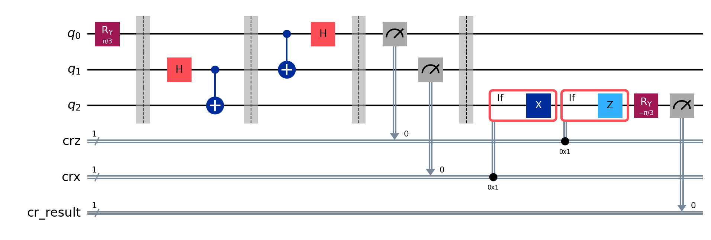
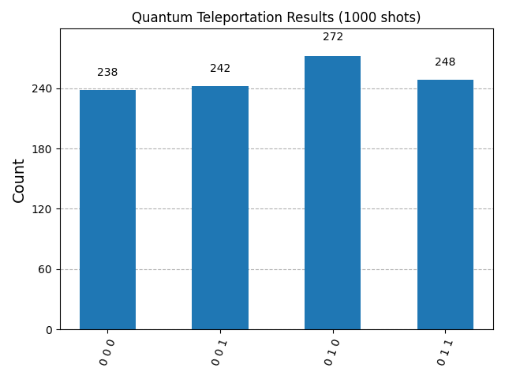

# Quantum Teleportation Protocol

A pure implementation of the **Quantum Teleportation Protocol** using **IBM Qiskit 1.0+**. This project demonstrates how quantum information (the state of a qubit) can be transmitted from one location to another using quantum entanglement and classical communication, without moving the physical particle itself.


## Overview

Quantum Teleportation is a fundamental protocol in Quantum Information Science. It allows two parties, **Alice** and **Bob**, to transfer an unknown quantum state $|\psi\rangle$ even if they are physically separated.

This process does not transport matter. Instead, it destroys the state at the source (Alice) and recreates it perfectly at the destination (Bob), relying on:
1.  **Quantum Entanglement** (The Quantum Channel).
2.  **Two bits of information** (The Classical Channel).

## Theoretical Background

The protocol relies on the manipulation of a 3-qubit system:
* **$q_0$ (Message):** The qubit in state $|\psi\rangle = \alpha|0\rangle + \beta|1\rangle$ that Alice wants to send.
* **$q_1$ (Alice's Resource):** Half of the entangled pair.
* **$q_2$ (Bob's Resource):** The other half, held by Bob.

### Key Concepts Implemented
* **Bell States (Entanglement):** Creating a link between $q_1$ and $q_2$ via Hadamard and CNOT gates.
* **Bell Measurement:** Alice performs a change of basis measurement on her qubits.
* **Dynamic Circuits (Feed-forward):** Bob applies corrections ($X$ or $Z$ gates) in real-time based on Alice's measurement results.

## The Protocol (Step-by-Step)

The circuit is divided into 4 distinct stages, as visualized below:



### 1. Initialization (The "Message")
We prepare the qubit $q_0$ in a specific, unknown state using a rotation $R_y(\theta)$. This acts as the "secret message" Alice wants to transmit.

### 2. Entanglement (The Bridge)
We create a Bell Pair between Alice ($q_1$) and Bob ($q_2$).
$$|\Phi^+\rangle = \frac{|00\rangle + |11\rangle}{\sqrt{2}}$$
At this point, $q_1$ and $q_2$ are perfectly correlated.

### 3. Bell Measurement (Alice's Action)
Alice entangles her message $q_0$ with her resource $q_1$ (CNOT + Hadamard) and measures both.
* The measurement collapses Alice's state.
* The results (2 classical bits) are sent to Bob.

### 4. Conditional Correction (Bob's Action)
The state of Bob's qubit $q_2$ has "teleported", but it might be rotated depending on Alice's results. Bob must apply a correction:
* **If $q_1$ measured 1:** Apply **X Gate** (Bit-flip).
* **If $q_0$ measured 1:** Apply **Z Gate** (Phase-flip).

> **Note on Code:** This project uses the modern **Qiskit Dynamic Circuits** syntax (`with qc.if_test...`) instead of the deprecated `c_if` method, ensuring compatibility with real quantum hardware.

## Verification & Results

To prove the teleportation was successful, we perform a validation test:
1.  After the protocol, Bob applies the **inverse rotation** $R_y(-\theta)$ to his qubit.
2.  If the state was perfectly teleported, the qubit should return exactly to the state $|0\rangle$.

### Benchmark
Running the simulation on `AerSimulator` (1000 shots):

| Metric | Result |
| :--- | :--- |
| **Target State** | $\vert 0\rangle$ (After inverse rotation) |
| **Success Rate** | **100%** |
| **Fidelity** | 1.0 |

The histogram below confirms the results. While Alice's measurements bits (the 2 rightmost bits) are random, **Bob's result (the leftmost bit) is always 0**, indicating successful teleportation.



## Installation & Usage

### Prerequisites
* Python 3.10+
* Qiskit 1.0+

### Setup
```bash
# Clone the repository
git clone https://github.com/numaguiot/quantum-teleportation.git
cd quantum-teleportation

# Create virtual env
python3 -m venv .venv
source .venv/bin/activate

# Install dependencies
pip install qiskit qiskit-aer matplotlib pylatexenc
```

### Running the Code
```bash
python teleportation.py
```
This will generate the circuit image and print the success rate in the terminal. 

## Author
* **Numa Guiot** - [Numa Guiot](https://github.com/numaguiot)
* LinkedIn: [Numa Guiot](https://www.linkedin.com/in/numaguiot/)
* Built with IBM Qiskit.

## License
Academic Project - Open Source (MIT License).
